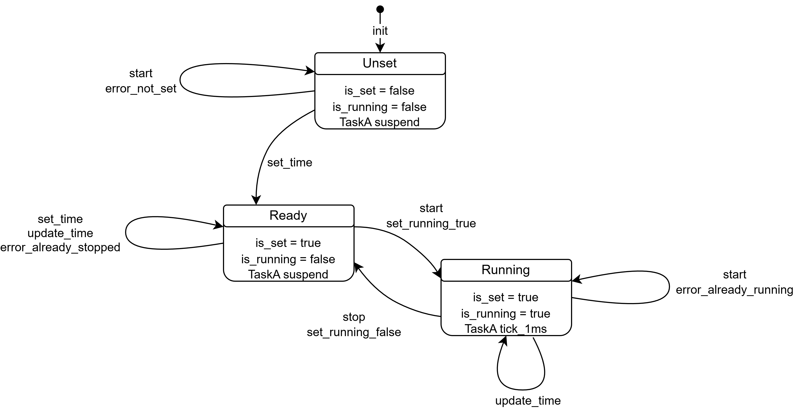
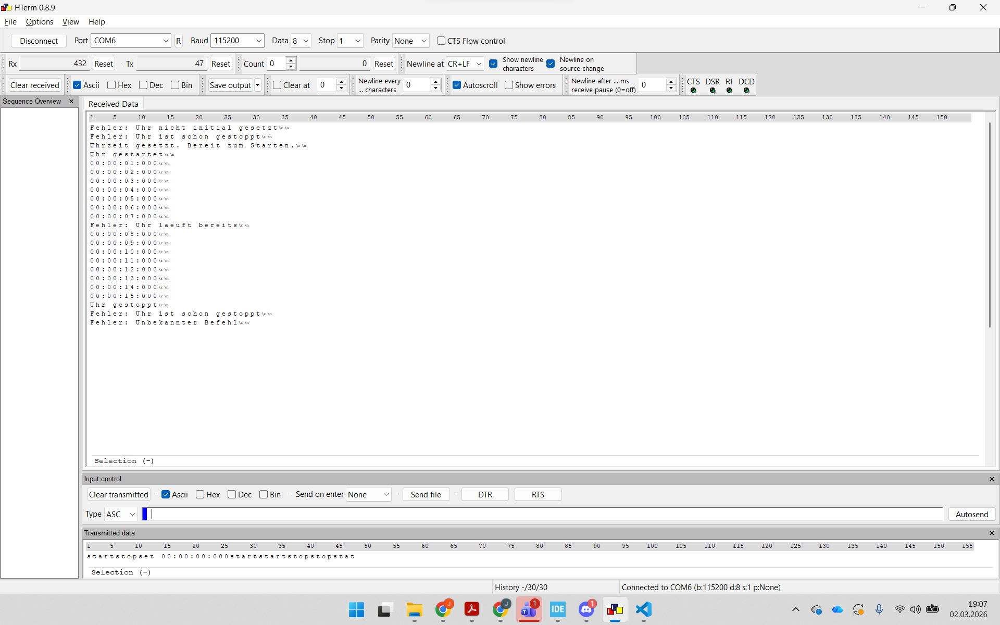

# Labor 5

Theoretischer Aufbau
-
Zustandsdiagramm:

Das Hochzählen der Uhr wird im Task A umgesetzt in dem jede Milisekunde sprich mit jedem Tick um 1 hochzählt wird und somit dann die Zeit errechnet wird. 

Die Auswertung der Eingabe wird über die Strncmp Funktion umgesetzt diese überprüft ,wenn die Länge des Wortes zur Eingabe passt, ob die Eingabe exakt mit dem Befehl übereinstimmt ist dies der Fall wird der entsprechende Befehl ausgeführt und die Antwort darauf gesendet. 

Zum Einlesen der Zahlen im Fall der set Eingabe wird ab der [4] Stelle im buffer gelesen da die Zahl 1 in ASCII die 49 ist muss man erst die ASCII '0' davon abziehen sprich die 48 um die eingegebene Zahl zu erhalten und so wird dann Stück für Stück das Array durchgegangen bis die Variablen für h, m, s und ms gefüllt sind. Die Zeit kann dann nur geschrieben werden wenn das Semaphore von der Callback Funktion genommen wird sprich die Antwort pdTrue ist. ISt dies der Fall wird die Zeit gesetzt und im ANschluss das Semaphor wieder freigegeben.

Da die Callback Funktion beim empfangen einer Nachricht über USB einen Interupt auslöst muss anstatt der Standard xSemaphoreTake Funktion eine für Interupts geeignete Variante xSemaphoreTakefromISR genutzt werden.

Ergebnisse
-

Ablauf der eingegebenen Befehle:

1. stop
2. start
3. set 00:00:00:000
4. start
5. start
6. stop
7. stop
8. stat

--> Die Anforderungen an die Uhr wurden erfüllt 